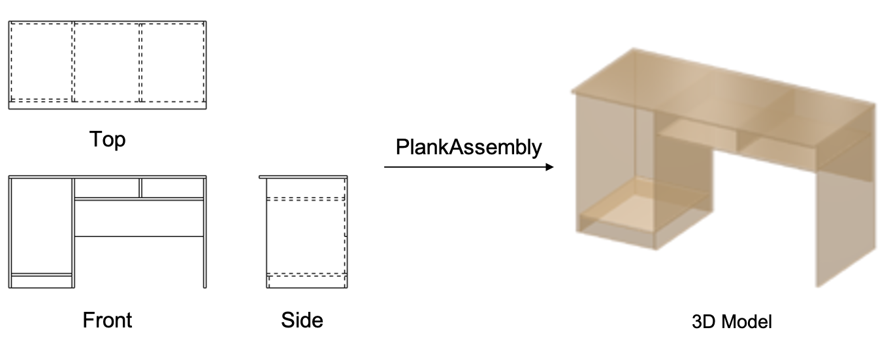

<div align="center">

# PlankAssembly: Robust 3D Reconstruction from Three Orthographic Views with Learnt Shape Programs

<h4>
  <a href='https://github.com/Huenao' target='_blank'>Wentao Hu</a>*
  ·
  <a href='https://bertjiazheng.github.io/' target='_blank'>Jia Zheng</a>*
  ·
  <a href='https://github.com/Elsa-zhang' target='_blank'>Zixin Zhang</a>*
  ·
  <a href='https://yuan-xiaojun.github.io/Yuan-Xiaojun/' target='_blank'>Xiaojun Yuan</a>
  ·
  <a href='https://sai.sysu.edu.cn/teacher/teacher01/1385356.htm' target='_blank'>Jian Yin</a>
  ·
  <a href='https://zihan-z.github.io/' target='_blank'>Zihan Zhou</a>
</h4>

<h4>
  IEEE/CVF Conference on Computer Vision (ICCV), 2023
</h4>

<h5>
  These authors contributed equally to this work.
</h5>

[](https://arxiv.org/abs/2308.05744)



</div>

## Setup 

Our code has been tested with Python 3.8, PyTorch 1.10.0, CUDA 11.3 and PyTorch Lightning 1.7.6.

### Installation

Clone the repository, then create and activate a `plankassembly` conda environment using the following commands.

```bash
# clone repository
git clone https://github.com/manycore-research/PlankAssembly.git
# create conda env
conda env create --file environment.yml
conda activate plankassembly
```

### Data Processing

The dataset can be found [here](https://github.com/manycore-research/PlankAssembly/wiki/Dataset). Please download the data first, then unzip the data in the project workspace.

The released dataset only contains 3D shape programs. To prepare the data for training and testing, please run the following commands.

We use [PythonOCC](https://github.com/tpaviot/pythonocc-core) to render three-view orthogonal engineering drawing, and save them as SVG files.

```bash
# render complete inputs
python dataset/render_complete_svg.py
# render noisy inputs, please specify the noise ratio
python dataset/render_noisy_svg.py --data_type noise_05 --noise_ratio 0.05
# render visible inputs
python dataset/render_visible_svg.py
```

Then, pack the input line drawings and output shape programs into JSON files.

```bash
python dataset/prepare_info.py --data_path path/to/data/root
```

### Training

Use the following command to train the model from scratch:

```bash
# train a model with complete lines as inputs
python trainer_complete.py fit --config configs/train_complete.yaml
```

### Inference

First download a [model checkpoint](model-checkpoints), use the following command to inference a pre-trained model:

```bash
# inference a model with complete lines as inputs
python trainer_complete.py test \
    --config configs/train_complete.yaml \
    --ckpt_path path/to/checkpoint.ckpt \
    --trainer.devices 1
```

### Evaluation

```bash
python evaluate.py --data_path path/to/data/dir --exp_path path/to/lightning_log/dir
```

### Model Checkpoints

Click the links below to download the checkpoint for the corresponding model type.

* Model trained on complete inputs: [here](https://manycore-research-azure.kujiale.com/manycore-research/PlankAssembly/models/line_complete-checkpoint_999-precision\=0.944-recall\=0.934-f1\=0.938.ckpt)
* Model trained on visible inputs only: [here](https://manycore-research-azure.kujiale.com/manycore-research/PlankAssembly/models/line_visible-checkpoint_999-precision=0.860-recall=0.843-f1=0.847.ckpt)
* Model trained on sideface inputs: [here](https://manycore-research-azure.kujiale.com/manycore-research/PlankAssembly/models/sideface-checkpoint_999-precision=0.944-recall=0.938-f1=0.939.ckpt)

## LICENSE

PlankAssembly is licensed under the [AGPL-3.0 license](LICENSE). The code snippets in the [third_party](third_party) folder are available under [Apache-2.0 License](third_party/LICENSE).
