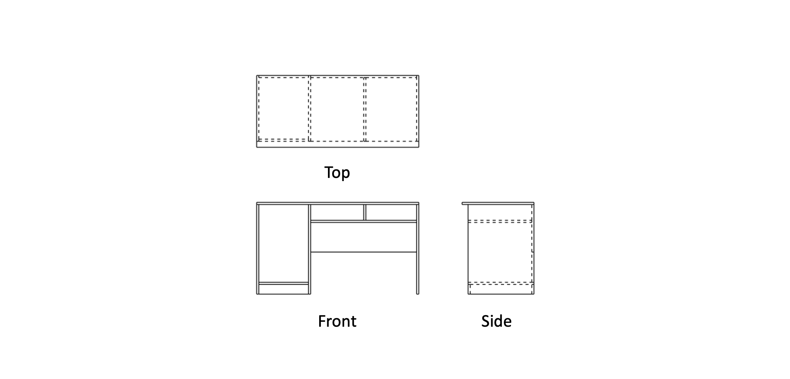

<div align="center">

# PlankAssembly: Robust 3D Reconstruction from Three Orthographic Views with Learnt Shape Programs

<h4>
  <a href='https://github.com/Huenao' target='_blank'>Wentao Hu</a>*
  ·
  <a href='https://bertjiazheng.github.io/' target='_blank'>Jia Zheng</a>*
  ·
  <a href='https://github.com/Elsa-zhang' target='_blank'>Zixin Zhang</a>*
  ·
  <a href='https://yuan-xiaojun.github.io/Yuan-Xiaojun/' target='_blank'>Xiaojun Yuan</a>
  ·
  <a href='https://sai.sysu.edu.cn/teacher/teacher01/1385356.htm' target='_blank'>Jian Yin</a>
  ·
  <a href='https://zihan-z.github.io/' target='_blank'>Zihan Zhou</a>
</h4>

<h4>
  IEEE/CVF Conference on Computer Vision (ICCV), 2023
</h4>

<h5>
  *These authors contributed equally to this work.
</h5>

[](https://arxiv.org/abs/2308.05744)
[](https://openaccess.thecvf.com/content/ICCV2023/html/Hu_PlankAssembly_Robust_3D_Reconstruction_from_Three_Orthographic_Views_with_Learnt_ICCV_2023_paper.html)



</div>

> [!NOTE]
> In our follow-up work, [CAD2Program](https://manycore-research.github.io/CAD2Program), we discovered that a modern vision models (e.g., ViT) can understand engineering drawings. For detailed implementation, please check [vit branch](https://github.com/manycore-research/PlankAssembly/tree/vit). 

> [!NOTE]
> This branch contains the implementation of PlankAssembly, which supports three types of inputs: (1) visible and hidden lines, (2) visible edges only, and (3) sidefaces.
> For raster images as inputs, please refer to the [raster branch](https://github.com/manycore-research/PlankAssembly/tree/atlas).
> For comparison with PolyGen, please refer to the [polygen branch](https://github.com/manycore-research/PlankAssembly/tree/polygen).

## Setup 

Our code has been tested with Python 3.8, PyTorch 1.10.0, CUDA 11.3, and PyTorch Lightning 1.7.6.

### Installation

Clone the repository, then create and activate a `plankassembly` conda environment using the following commands.

```bash
# clone repository
git clone https://github.com/manycore-research/PlankAssembly.git
# create conda env
conda env create --file environment.yml
conda activate plankassembly
```

<details>

<summary>
If you encounter any issue with provided conda environment, you may install dependencies manually using the following commands.
</summary>

```bash
conda create -n plankassembly python=3.8
conda activate plankassembly
conda install pytorch==1.10.0 torchvision==0.11.0 torchaudio==0.10.0 cudatoolkit=11.3 -c pytorch -c conda-forge
pip install pytorch-lightning==1.7.7 torchmetrics==0.11.4 rich==12.5.1 'jsonargparse[signatures]'
pip install detectron2 -f https://dl.fbaipublicfiles.com/detectron2/wheels/cu113/torch1.10/detectron2-0.6%2Bcu113-cp38-cp38-linux_x86_64.whl
conda install -c conda-forge pythonocc-core=7.6.2
pip install numpy shapely svgwrite svgpathtools trimesh setuptools==59.5.0 html4vision
```

</details>

### Dataset

The dataset can be found on [Hugging Face Datasets](https://huggingface.co/datasets/manycore-research/PlankAssembly). Please download the data first, then unzip the data in the project workspace.

The released dataset only contains 3D shape programs. To prepare the data for training and testing, please run the following commands.

We use [PythonOCC](https://github.com/tpaviot/pythonocc-core) to render three-view orthogonal engineering drawings and save them as SVG files.

```bash
# render complete inputs
python dataset/render_complete_svg.py
# render noisy inputs, please specify the noise ratio
python dataset/render_noisy_svg.py --data_type noise_05 --noise_ratio 0.05
# render visible inputs
python dataset/render_visible_svg.py
```

Then, pack the input line drawings and output shape programs into JSON files.

```bash
python dataset/prepare_info.py --data_path path/to/data/root
```

To visualize the 3D model, we could generate the ground-truth 3D meshes from shape.

```bash
python misc/build_gt_mesh.py --data_path path/to/data/root
```

## Training

Use the following command to train a model from scratch:

```bash
# train a model with complete lines as inputs
python trainer_complete.py fit --config configs/train_complete.yaml
```

## Testing

Use the following command to test with a pre-trained model:

```bash
# infer a model with complete lines as inputs
python trainer_complete.py test \
    --config configs/train_complete.yaml \
    --ckpt_path path/to/checkpoint.ckpt \
    --trainer.devices 1
```

## Evaluation

To compute the evaluation metrics, please run the following command:

```bash
python evaluate.py --data_path path/to/data/dir --exp_path path/to/lightning_log/dir
```

## Visualization

To visualize the results, we build 3D mesh models from predictions:

```bash
python misc/build_pred_mesh.py --exp_path path/to/lightning_log/dir
```

Then, we use [HTML4Vision](https://github.com/mtli/HTML4Vision) to generate HTML files for mesh visualization (please refer to [here](https://github.com/mtli/HTML4Vision/#3d-models) for more details):

```bash
python misc/build_html.py --exp_path path/to/lightning_log/dir
```

The 2D images presented in our paper are rendered using [bpy-visualization-utils](https://github.com/davidstutz/bpy-visualization-utils). 

## Model Checkpoints

The checkpoints can be found on [Hugging Face Models](https://huggingface.co/manycore-research/PlankAssembly). Or click the links below to download the checkpoint for the corresponding model type directly.

* Model trained on complete inputs: [here](https://manycore-research-azure.kujiale.com/manycore-research/PlankAssembly/models/line_complete-checkpoint_999-precision\=0.944-recall\=0.934-f1\=0.938.ckpt)
* Model trained on visible inputs only: [here](https://manycore-research-azure.kujiale.com/manycore-research/PlankAssembly/models/line_visible-checkpoint_999-precision=0.860-recall=0.843-f1=0.847.ckpt)
* Model trained on sideface inputs: [here](https://manycore-research-azure.kujiale.com/manycore-research/PlankAssembly/models/sideface-checkpoint_999-precision=0.944-recall=0.938-f1=0.939.ckpt)

## LICENSE

PlankAssembly is licensed under the [AGPL-3.0 license](LICENSE). The code snippets in the [third_party](third_party) folder are available under [Apache-2.0 License](https://www.apache.org/licenses/LICENSE-2.0).
